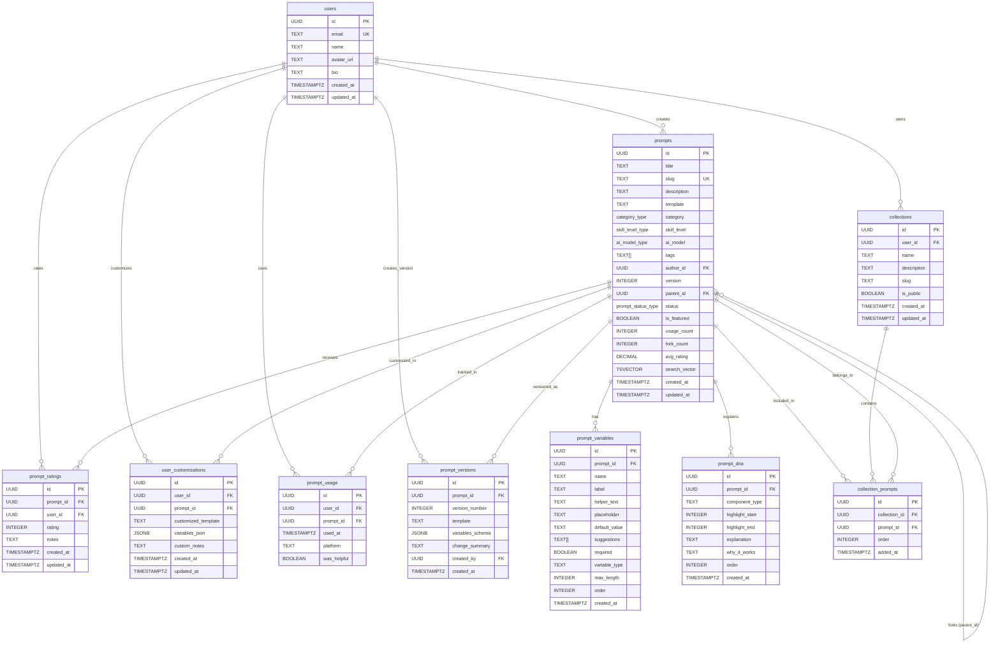

# Prompt Toolkit Database ERD

## Key Relationships

### One-to-Many
- **users → prompts**: A user can create many prompts (author)
- **users → collections**: A user can create many collections
- **users → prompt_ratings**: A user can rate many prompts
- **users → user_customizations**: A user can customize many prompts
- **users → prompt_usage**: A user can use many prompts
- **prompts → prompt_variables**: A prompt has many variables
- **prompts → prompt_dna**: A prompt has many DNA annotations
- **prompts → prompt_versions**: A prompt has version history
- **prompts → prompt_ratings**: A prompt receives many ratings
- **collections → collection_prompts**: A collection contains many prompts

### Many-to-Many
- **prompts ↔ collections**: Through `collection_prompts` junction table
  - Allows same prompt to be in multiple collections
  - Allows collection to have multiple prompts
  - Includes order for custom sorting

### Self-Referential
- **prompts → prompts**: Parent-child relationship for versioning/forking
  - `parent_id` references original prompt
  - Enables version tree navigation
  - `NULL` parent_id = original prompt

## Indexes Summary

### Primary Indexes
- All tables have UUID primary keys
- Composite unique constraints on junction tables

### Performance Indexes
- **Full-text search**: GIN index on `prompts.search_vector`
- **Tag search**: GIN index on `prompts.tags` (array)
- **Foreign keys**: All FK columns indexed for JOIN performance
- **Filtering**: Indexes on category, skill_level, status
- **Sorting**: Indexes on created_at, order columns
- **User queries**: Composite indexes on (user_id, timestamp)

### Partial Indexes
- `is_featured` index (WHERE is_featured = true)
- `is_public` index (WHERE is_public = true)

## Triggers & Automation

1. **Auto-update timestamps**: `updated_at` on users, prompts, collections, ratings
2. **Full-text search**: Auto-update `search_vector` when title/description/template/tags change
3. **Average rating**: Auto-calculate `prompts.avg_rating` when ratings added/updated/deleted

## Enums

- **category_type**: marketing, code, writing, research, personal, business, education, creative
- **skill_level_type**: beginner, intermediate, advanced, expert
- **ai_model_type**: gpt4, claude, gemini, llama, universal
- **prompt_status_type**: draft, published, archived, flagged

## Views

1. **prompts_with_author**: Prompts joined with author name/avatar
2. **popular_prompts**: Top prompts by usage in last 30 days

## Functions

1. **search_prompts()**: Full-text search with filters, pagination, ranking
2. **get_prompt_details()**: Fetch prompt + variables + DNA + author in one call
